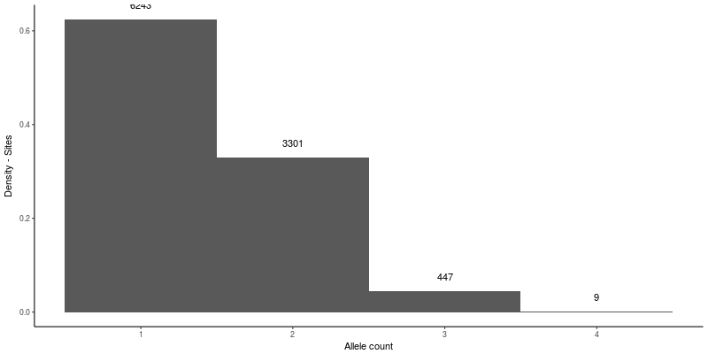

**GACMSA**: **G**et **A**llelic **C**ount from **M**ultiple **S**equence **A**lignments
-----

[](https://travis-ci.org/merlyescalona/gacmsa)

© 2017 Merly Escalona (<merlyescalona@uvigo.es>)

University of Vigo, Spain, http://darwin.uvigo.es

# Assumptions

- Assumes the input file is a Multiple Sequence Alignment file, meaning, all
sequences have the same length.

# Install

Clone this repository and install it with user privileges

```
git clone https://github.com/merlyescalona/gacmsa.git
cd gacmsa
python setup.py instal --user
```

# Usage:
```
usage: gacmsa.py -i <filepath> -o <filepath> [-l <log_level>] [-v] [-h]
```

**Required arguments**:
- `-i <filepath>`, `--input <filepath>`: Multiple-alignment sequence file (MSA).
- `-o <filepath>`, `--output <filepath>`: Output file

**Optional arguments**:
- `-l <log_level>`, `--log <log_level>`: Specified level of log that will be shown through the standard output. Entire log will be stored in a separate file.
    - Values:['DEBUG', 'INFO', 'WARNING', 'ERROR']. Default: `INFO`.

**Information arguments**:
- `-v`, `--version`  : Show program's version number and exit
- `-h`, `--help`: Show this help message and exit

# Input

- a Multiple Sequence alignment file path ([MSA](https://en.wikipedia.org/wiki/Multiple_sequence_alignment))

# Output

- Output file (plain text), opened with `cat output.txt | less -S` will give you:

```
POSITION            1       2       3       4       5       6       7       8       9      10
       A            1       0       0       0       0       0       0       0       0       0
       C            0       0       0       0       0      31       0       0      31       0
       T           30       0      30       0       0       0       0       6       0      30
       G            0      31       1      31      31       0      31      25       0       1
       N            0       0       0       0       0       0       0       0       0       0
     GAP            0       0       0       0       0       0       0       0       0       0
   TOTAL            2       1       2       1       1       1       1       2       1       2
31      (10)
```


Where:

- Line 1: POSITION corresponds to the base position, and will have as many columns as the length of the given sequences.
- Line 2: **`A`**, corresponds to the count of `A` alleles in `POSITION`, for all the sequences.
- Line 3: **`C`**, corresponds to the count of `C` alleles in `POSITION`, for all the sequences.
- Line 4: **`G`**, corresponds to the count of `G` alleles in `POSITION`, for all the sequences.
- Line 5: **`T`**, corresponds to the count of `T` alleles in `POSITION`, for all the sequences.
- Line 6: **`N`**, corresponds to the count of `N`s in `POSITION`, for all the sequences.
- Line 7: **`GAP`**, corresponds to the count of `GAPs` (`-`) in `POSITION`, for all the sequences.
- Line 8: **`TOTAL`**, corresponds to the number of alleles for the specific `POSITION`.
- Line 9: gives the number of sequences and the size of the sequences in the given file. Format: `NumberOfSequences   (LengthOfSequence)`


# Quick start guide

There's a test file under `test/data.fasta` with `63` individuals, and sequences of `10.000` bp.

```
$gacmsa -i data.fasta -o gacmsa.output

22/11/2017 01:08:46 PM - INFO:	Start...
22/11/2017 01:08:46 PM - INFO:	Parsing MSA file: /home/user/test/data.fasta
22/11/2017 01:08:46 PM - INFO:	Calculating Allelic counts
22/11/2017 01:08:47 PM - WARNING:	Sequence size: 10000 and matrix cols: 10000
22/11/2017 01:08:48 PM - INFO:	Writing output into: /home/user/test/gacmsa.output
22/11/2017 01:08:48 PM - INFO:	Process finished
22/11/2017 01:08:48 PM - INFO:	GACMSA finished properly.
22/11/2017 01:08:48 PM - INFO:	Elapsed time (ETA):	0:00:01.440117
22/11/2017 01:08:48 PM - INFO:	Ending at:	Wed, Nov 22 2017. 01:08:48 PM
```


Then, from the file we can remove the last lines so we can plot the information with R code:

```
head -8  gacmsa.output > gacmsa.notail.output
```

Then we can user R, with the following code to obtain the frequencies of the monoallelic, di-allelic, tri-allelic and tetra-allelic sites (if they exist in the MSA).

```{R}
library(ggplot2)
mydata=read.table("gacmsa.notail.output", header=T)
rowNames=mydata[,1]
rownames(mydata)=rowNames
mydata=mydata[,2:ncol(mydata)]
mydata=data.frame(t(mydata))
rownames(mydata)=paste0("POS",1:nrow(mydata))
ggplot(mydata, aes(x=mydata$TOTAL))+geom_histogram(aes(y=..density..), bins=4) + theme_classic() +
    stat_bin(aes(label=..count.., y=..density..), bins=4, geom="text", col="black", vjust=-1.5) +
    xlab("Allele count") + ylab("Density - Sites")
```

